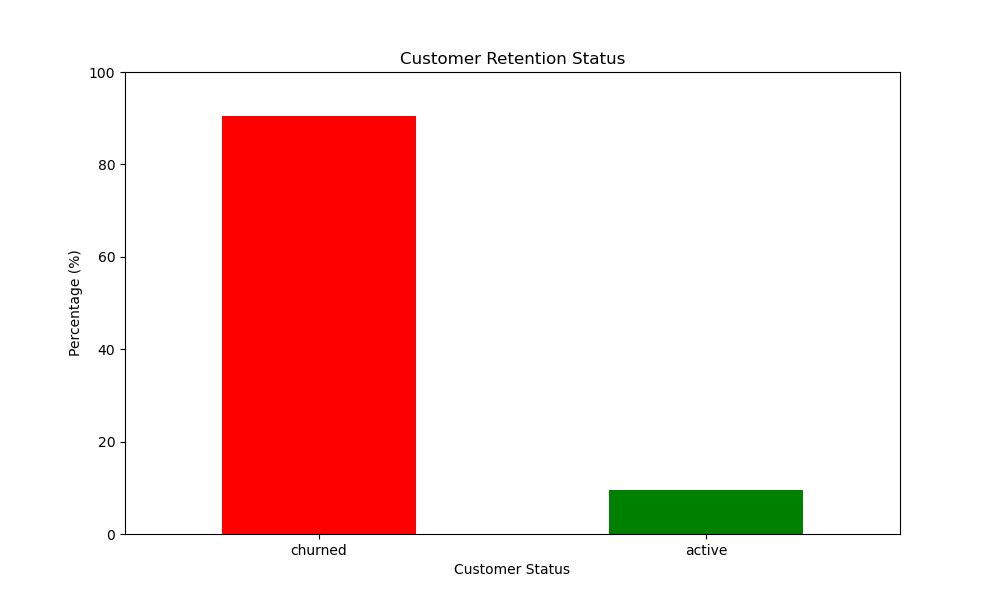
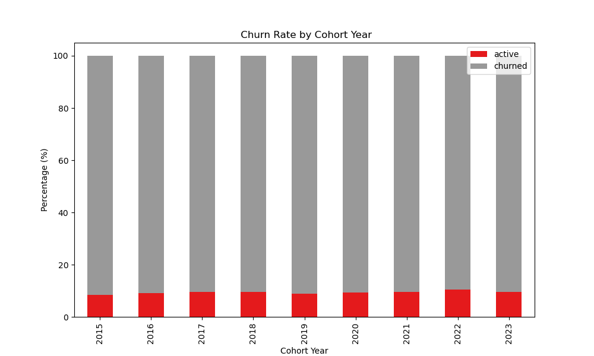
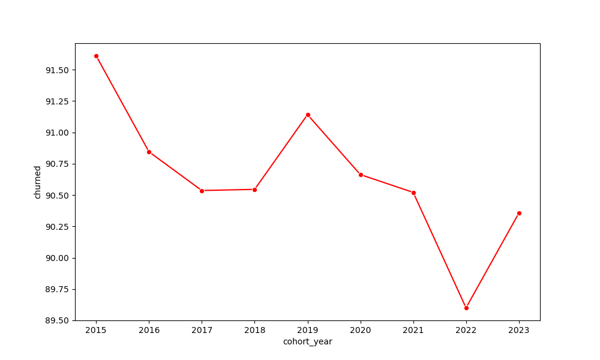

# Customer Churn & Cohort Retention Analysis

## Introduction
Explore customer lifecycle dynamics! This project looks at historical transaction data from the contoso_100k database to find:

The baseline churn rate using a rolling 6-month inactivity window.

How retention changes over time for different yearly customer cohorts.

The overall trend of customer loyalty across successive enrollment years.

🔍 **View the code:** You can find the SQL queries in the [SQL_code folder](/SQL_code) and Python scripts in the [Python_code folder](/Python_code)

## Goals
The questions I wanted to answer through my SQL queries and Python visualizations were:
1. What is the baseline distribution of active vs. churned customers in the historical dataset?
2. How do customer retention rates vary when segmenting users into yearly entry cohorts?
3. What is the continuous trend of customer churn over successive enrollment years?
4. How can we isolate true historical customer behavior by removing baseline distortion from the data?

## The Analysis
Each block of this SQL query plays a specific role in extracting and cleaning our data to calculate accurate customer retention metrics. Here is the step-by-step breakdown:

#### 1.  Data Aggregation (customer_revenue CTE)
To start our analysis, we need to gather all transactional data and connect it directly to our customer profiles.

- **What it does:** We join the sales table with the customer table. We use SUM to find the total money spent and COUNT to see how many orders each customer made on any specific day.

- **Why we use it:** This gives us a clean baseline of daily financial behavior for every unique user.

```sql
WITH customer_revenue AS (	
	SELECT
		s.customerkey, 
		s.orderdate,
		sum(s.quantity * s.netprice * s.exchangerate) AS total_revenue,
		count(s.orderkey) AS num_orders,
		c.countryfull,
		c.age,
		c.givenname,
		c.surname
	FROM
		sales s
	LEFT JOIN customer c ON c.customerkey = s.customerkey
	GROUP BY 
		s.customerkey, s.orderdate, c.countryfull, c.age, c.givenname, c.surname
)
```

#### 2. Identifying the Cohort Milestone (purchasing_behavior CTE)
Next, we need to know exactly when each customer started their journey with the business.

- **What it does:** We use the window function MIN(orderdate) OVER(PARTITION BY customerkey). This scans every transaction for a customer and extracts their earliest historical purchase date. We also extract the year from this date to define their cohort year.

- **Why we use it:** This allows us to group our customers into distinct yearly generations (cohorts) based on their joining milestone.

```sql
, purchasing_behavior AS (
SELECT
	cr.*,
	 min(cr.orderdate) OVER(PARTITION BY cr.customerkey) AS first_purchase_date,
	 EXTRACT(YEAR FROM min(cr.orderdate) OVER(PARTITION BY cr.customerkey)) AS cohort_year
FROM
	customer_revenue cr
)
```

#### 3. Finding the Last Touchpoint (customer_last_purchase CTE)
To determine if someone has churned, we must look at their final transaction and compare it to the absolute end of the database timeline.


- What it does: * We use ROW_NUMBER() OVER(PARTITION BY customerkey ORDER BY orderdate DESC) to label a user's transactions from newest to oldest. Their most recent purchase gets a purchase_number = 1.

- We also use MAX(orderdate) OVER() to extract the latest operational date across the entire dataset (max_purchase_date).

- Why we use it: This isolates the last day the customer interacted with the store and provides a current reference point to compare against.

```sql
, customer_last_purchase AS (
SELECT
    customerkey,
    givenname,
    orderdate,
    row_number() OVER(PARTITION BY customerkey ORDER BY orderdate desc)  AS purchase_number,
    first_purchase_date,
    max(orderdate) over() as max_purchase_date
FROM 
    purchasing_behavior
)
```

#### 4. Final Segmentation & Filtering (Main Query)
The final step calculates the status and applies strict rules to ensure our insights are perfectly accurate.

- **What it does:** We use a CASE WHEN statement to check if a customer's last order date is older than 6 months from our dataset ceiling (max_purchase_date - INTERVAL '6 month'). If it is older, they are labeled 'churned', otherwise they are 'active'.

   - In the WHERE clause, we filter for purchase_number = 1 to look only at their final transaction. We also add first_purchase_date < max_purchase_date - INTERVAL '6 month' to completely remove baseline distortion by excluding brand-new users.

- **Why we use it:** This extracts a pure, finalized list of historical customer statuses.

```sql
SELECT
    customerkey,
    givenname,
    extract(year from first_purchase_date) as cohort_year,
    orderdate as last_purchase_date,
    case 
        when orderdate < max_purchase_date - INTERVAL '6 month' then 'churned'
        else 'active'
        end as customer_status
from 
    customer_last_purchase
WHERE 
    purchase_number = 1 
    and first_purchase_date < max_purchase_date - INTERVAL '6 month'
```

#### 5. Output Data Layer (Customer_Retention.csv)
After executing the multi-stage SQL pipeline, the query outputs a structured table. Below is a sample of the first few rows showing how each user is grouped into their initial cohort year and evaluated for churn:

| customerkey | givenname  | cohort_year | last_purchase_date | customer_status |
|-------------|------------|------------|------------------|----------------|
| 15          | Julian     | 2021       | 3/8/2021         | churned        |
| 180         | Gabriel    | 2018       | 8/28/2023        | churned        |
| 185         | Gabrielle  | 2019       | 6/1/2019         | churned        |
| 243         | Maya       | 2016       | 5/19/2016        | churned        |


#### 6. Visual Outcomes & Results
After exporting this clean data layer via SQL, I used Python to visualize the business insights.

### Customer Retention Status


**Insights:**

- Most Customers Left: The bar chart shows that 90.53% of historical customers have stopped buying things (churned).

- Small Active Group: Only 9.47% of customers are still active and buying items.

- Main Lesson: The company is good at getting new customers, but bad at keeping them for a long time. They need to find ways to make customers stay.

### Churn Rate by Cohort Year


**Insights:**

- Churn is the Same: The stacked bar chart shows that the churn rate is almost exactly the same for every single year. It does not matter if a customer joined in 2016 or 2021; about 90% of them eventually churn.

- System Problem: Because the numbers are the same across all cohorts, it shows that the high churn rate is a constant, long-term problem for the business, not a one-time issue.

### Churn Trend Over Cohort Years



**Insights:**

- Showing the Line: This line chart shows the exact path of churned customers over the years.

- Helping the Business: Looking at this line helps managers see exactly which years had the worst results so they can fix the problems


## What I Learned
In this project, I improved my data and SQL skills by working on real business problems:
* **Advanced SQL Functions:** I learned how to use CTEs (`WITH` clauses) to keep my query organized and split it into clean steps.
* **Window Functions:** I learned how to use `MIN() OVER()` to find the first time a customer bought an item, and `ROW_NUMBER() OVER()` to track their very last purchase.
* **Cleaning Data:** I learned how to filter out brand-new users to make sure my final results did not have baseline distortions.

## Conclusions
From this analysis, we can see these clear findings about the business:
* **High Baseline Churn:** The company has a massive churn problem, with over 90% of all historical customers becoming inactive.
* **No Cohort Improvement:** The churn rate is constant. The problem does not change across different entry years, meaning the core retention strategy needs a complete review.
* **Value of Analytics:** This project shows how useful it is to combine SQL and Python. SQL cleans the data, and Python helps us see the patterns clearly to guide business managers.